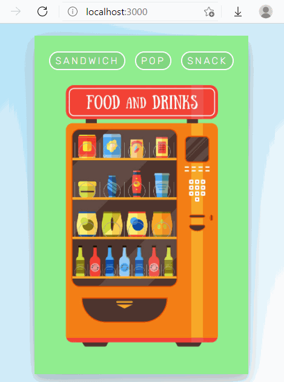
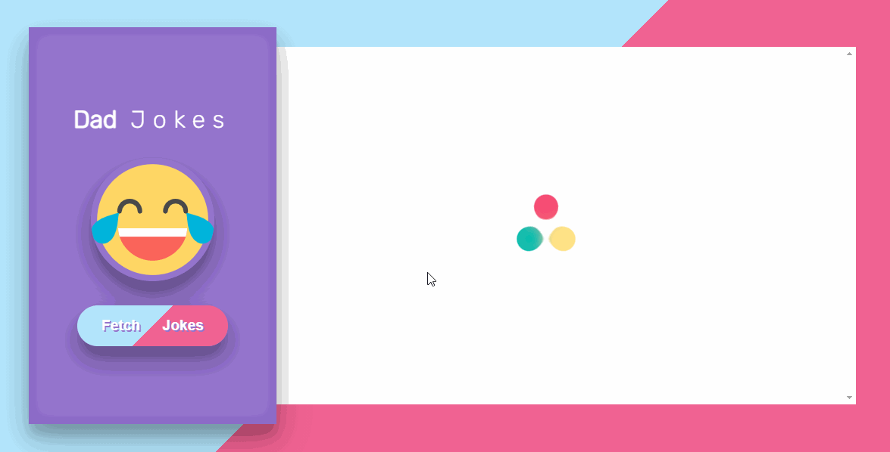
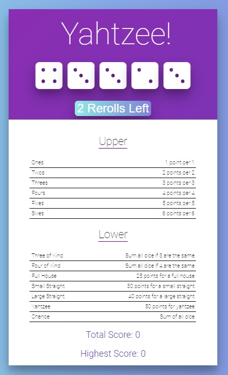

# React Studies - Project collection

Collection of projects made with [Create React App](https://github.com/facebook/create-react-app).
- 11 - [CheeZ Jokes App](https://github.com/DougFelix/ReactStudies#cheez-jokes-app)
- 10 - [Card Dealer](https://github.com/DougFelix/ReactStudies#card-dealer)
- 09 - [Yahtzee Game](https://github.com/DougFelix/ReactStudies#yahtzee-game)
- 08 - [Todo List App](https://github.com/DougFelix/ReactStudies#todo-list-app)
- 07 - [Color Box Maker](https://github.com/DougFelix/ReactStudies#color-box-maker)
- 06 - [Lights Out Game](https://github.com/DougFelix/ReactStudies#lights-out-game)
- 05 - [Hangman Game](https://github.com/DougFelix/ReactStudies#hangman-game)
- 04 - [Color Boxes](https://github.com/DougFelix/ReactStudies#color-boxes)
- 03 - [Coin Flipper](https://github.com/DougFelix/ReactStudies#coin-flipper)
- 02 - [Rolling Dice](https://github.com/DougFelix/ReactStudies#rolling-dice)
- 01 - [Pokegame](https://github.com/DougFelix/ReactStudies#pokemon-game)

## Goal:
The goal is to document all projects done during my React studies, their descriptions and study topics to better analyze my progress.

# `Vending Machine`
Finished: _20/05/2021_

### Description:
The main goal of this project was to use React Router to build a Vending Machine. Also, I used a little of SCSS for the animation.

### Praticed Topics:
* Client-Side Routing
* React Router
* Switch / Exact
* Link Component
* NavLinks
* Render props / Component prop in Routes
* SCSS

  

# `CheeZ Jokes App`
Finished: _19/05/2021_

### Description:
This project was to build from scratch an app that lets people view and vote on cheesy jokes. To generate jokes, it was used the ICanHazDadJoke API.

### Praticed Topics:
* Lifecycle methods - componentDidMount()
* Loading Data via AJAX - using axios
* Async functions / await
* LocalStorage
* Loading spinner

  

# `Card Dealer`
Finished: _13/05/2021_

### Description:
This project is an app that displays a deck of cards, one card at a time. When the page loads, it sends a request to an API to create a new deck. When the user draw a card, it sends another request to the API that gets a card from that specific deck. User can draw until the deck is empty.

### Praticed Topics:
* Lifecycle methods - componentDidMount()
* Loading Data via AJAX - using axios
* Async functions / await

  

# `Yahtzee Game`
Finished: _11/05/2021_

### Description:
In this exercise the goal was to practice some of the topics learned so far in a "bigger" application (6 components). The app wasn't build from scratch. There were some bugs to fix and new features to add.

Yahtzee is a chance-and-strategy dice rolling game. A game is played over 13 rounds.

### Praticed Topics:
* Component Design
* Upward / Downward Data Flow
* Passing props multiple levels deep
* LocalStorage

  

# `Todo List App`
Finished: _05/05/2021_

### Description:
Project to practice working with React forms.
A Todo App that allows users to see, add, edit, and remove todos.

### Praticed Topics:
* Component Design
* Forms in React
* Multiple Inputs
* Upward / Downward Data Flow
* UUID Library
* Styling CSS in React 
* LocalStorage

  

# `Color Box Maker`
Finished: _05/03/2021_

### Description:
Exercise to practice working with React forms.
It contains a form which receives a width, a height and color input to generete squares, that can be deleted.

### Praticed Topics:
* Forms in React
* Multiple Inputs
* Design Pattern: Passing Data Upwards
* UUID Library

  

# `Lights Out Game`
Finished: _04/30/2021_

### Description:
This exercise provides a chance to work with React events where the state and events happen in different classes.
Lights Out is a logic/puzzle game, played on a gird of individual lights, which can either be lit or unlit. The puzzle is won when when all of the lights are turned off.
You can click on a cell to toggle that light — but it also toggles the light above it, to the left of it, to the right of it, and below it. (Cells on an edge or in the corner won’t flip as many lights, since they are missing some neighbors).

### Praticed Topics:
* Component Design (Stateless Child)
* React Events
* Method Binding
* Binding with arguments
* Passing Methods to Child Components
* Parent-Child React Naming (action / handleAction)
* React Keys
* CSS Animations / Transitions

  

# `Hangman Game`
Finished: _04/28/2021_

### Description:
A React hangman game project.

### Praticed Topics:
* React Events
* Method Binding
* Alternative Binding
* Binding with arguments
* Passing Methods to Child Components
* Parent-Child React Naming (action / handleAction)
* React Keys

  

# `Color Boxes`
Finished: _04/26/2021_

### Description:
This exercise shows a series of boxes (a box is just square div with a background color).
Initially, each box should have a background color chosen from a random list of colors. When clicked, it change its color to a different random color.

### Praticed Topics:
* setState - Updating Existing State
* Designing State
* Downward Data Flow
* Stateful Parents
* Stateless Children

  

# `Coin Flipper`
Finished: _04/23/2021_

### Description:
In this exercise it is praticed working with props, defaultProps, state, and simple click events in React. Also, it provides more experience in setting state and binding event handlers.
The exercise is to create a coin flipping counter.
The user is able to click on a button to flip a coin. Every time the user clicks, the coin gets flipped again. The app keeps track of how many times heads and tails have shown up.

### Praticed Topics:
* setState - Updating Existing State
* Designing State
* Downward Data Flow
* Stateful Parents
* Stateless Children

  

# `Rolling Dice`
Finished: _04/22/2021_

### Description:
This mini-project practices working with props, defaultProps, state, and simple click events in React. The project is an app that lets us roll a pair of dices. While the dices are rolling the user can't do another action.

### Praticed Topics:
* State
* Constructor

  

# `Pokemon Game`
Finished: _04/16/2021_

### Description:
This project pratices the use of React components and properties.
A simple Pokemon based game (a “pokedex”) that displays an interface which randomly select two hands of Pokemon cards (every time it reloads) and compare each other experience to determine the winner.

### Praticed Topics:
* Using CRA
* Props / defaultProps
* Components
* CSS in React

  

# NOTES:

To run any of the projects is required to `npm install`.
